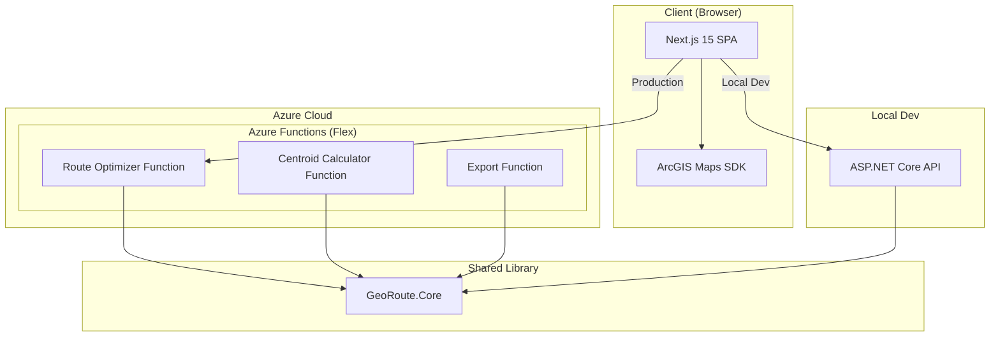
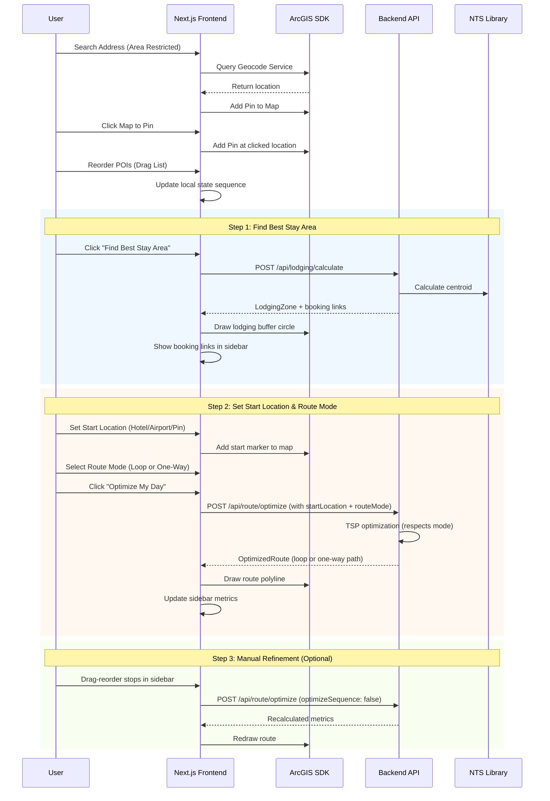

# Technical Design Document: GeoRoute Optimizer

| Metadata | Details |
| :--- | :--- |
| **Version** | 1.1 |
| **Status** | Draft |
| **Last Updated** | 2026-01-14 |
| **Author** | Hangxi Xiang |
| **Phase** | Phase 1 (MVP) |

---

## 1. Executive Summary

This document outlines the technical architecture for Phase 1 of GeoRoute Optimizer—a spatial decision-support tool that optimizes travel itineraries. The architecture prioritizes **developer experience (DX)** during local development while enabling **serverless scale** in production via Azure Functions.

---

## 2. Technology Stack

| Layer | Technology |
|-------|------------|
| **Frontend** | Next.js 15 + ArcGIS Maps SDK for JavaScript |
| **Backend** | .NET 10 / ASP.NET Core Web API |
| **Geospatial** | NetTopologySuite (NTS) |
| **PDF Export** | QuestPDF |
| **Deployment** | Azure Functions (Consumption Plan) |
| **State Management** | **Zustand** (Client store) + **URL Search Params** (Persistence/Sharing) |

---

## 3. System Architecture

### 3.1 High-Level Architecture



### 3.2 Shared Library Architecture

The key architectural decision is a **shared .NET Core library** (`GeoRoute.Core`) containing all business logic, consumed by both:

1. **ASP.NET Core Web API** — for local development with hot reload, debugging, and OpenAPI docs
2. **Azure Functions** — for production deployment with serverless scale

```
/backend
├── GeoRoute.Core/              # 📦 Shared library (all business logic)
│   ├── Services/
│   │   ├── RouteOptimizerService.cs
│   │   ├── CentroidCalculatorService.cs
│   │   └── ExportService.cs
│   ├── Models/
│   │   ├── PointOfInterest.cs
│   │   ├── OptimizedRoute.cs
│   │   └── LodgingZone.cs
│   └── GeoRoute.Core.csproj
│
├── GeoRoute.Api/               # 🖥️ Local dev API (thin wrapper)
│   ├── Controllers/
│   │   └── RouteController.cs
│   ├── Program.cs
│   └── GeoRoute.Api.csproj
│
└── GeoRoute.Functions/         # ☁️ Azure Functions (thin wrapper)
    ├── Functions/
    │   ├── OptimizeRouteFunction.cs
    │   ├── CalculateCentroidFunction.cs
    │   └── ExportPdfFunction.cs
    ├── Program.cs
    └── GeoRoute.Functions.csproj
```

---

## 4. Phase 1 API Design

### 4.1 Endpoints

| Endpoint | Method | Description | PRD Requirement |
|----------|--------|-------------|-----------------|
| `/api/lodging/calculate` | POST | Calculate geometric center + buffer for best stay area | FR-1.3, FR-1.4 |
| `/api/route/optimize` | POST | Calculate optimal route sequence with Loop or One-Way mode | FR-1.6, FR-1.7, FR-1.9 |
| `/api/export/pdf` | POST | Generate PDF itinerary | FR-1.11 |

> [!NOTE]
> Manual reordering (FR-1.10) is handled by the `/api/route/optimize` endpoint with `optimizeSequence: false`. This avoids a redundant endpoint.

### 4.2 Request/Response Models

#### Calculate Lodging Zone Request
```json
{
  "points": [
    { "id": "p1", "name": "Banff Gondola", "lat": 51.1483, "lng": -115.5700 },
    { "id": "p2", "name": "Lake Louise", "lat": 51.4167, "lng": -116.2167 },
    { "id": "p3", "name": "Moraine Lake", "lat": 51.3217, "lng": -116.1860 }
  ],
  "bufferRadiusKm": 15
}
```

> [!NOTE]
> **Auto-calculation**: The frontend automatically calls `/api/lodging/calculate` whenever there are **2 or more active POIs**. The lodging zone updates in real-time as the user adds/removes pins.

#### Calculate Lodging Zone Response
```json
{
  "centroid": { "lat": 51.2956, "lng": -115.9909 },
  "bufferRadiusKm": 15,
  "bookingLinks": {
    "bookingCom": "https://www.booking.com/searchresults.html?ss=51.2956,-115.9909&radius=15",
    "airbnb": "https://www.airbnb.com/s/homes?lat=51.2956&lng=-115.9909"
  }
}
```

#### Optimize Route Request
```json
{
  "points": [
    { "id": "p1", "name": "Banff Gondola", "lat": 51.1483, "lng": -115.5700 },
    { "id": "p2", "name": "Lake Louise", "lat": 51.4167, "lng": -116.2167 },
    { "id": "p3", "name": "Moraine Lake", "lat": 51.3217, "lng": -116.1860 }
  ],
  "startLocation": { "name": "Fairmont Banff Springs", "lat": 51.1670, "lng": -115.5570 },
  "routeMode": "loop",
  "optimizeSequence": true,
  "manualSequence": null
}
```

> [!TIP]
> - `routeMode`: `"loop"` (Return to Start) or `"one-way"` (End at last POI)
> - When `optimizeSequence: false`, the backend uses `manualSequence` (e.g., `["p2", "p1", "p3"]`) and only recalculates travel times.

#### Optimize Route Response
```json
{
  "sequence": ["p1", "p3", "p2"],
  "legs": [
    { "from": "start", "to": "p1", "distanceKm": 2.5, "durationMin": 5 },
    { "from": "p1", "to": "p3", "distanceKm": 45.2, "durationMin": 52 },
    { "from": "p3", "to": "p2", "distanceKm": 12.1, "durationMin": 15 },
    { "from": "p2", "to": "start", "distanceKm": 38.0, "durationMin": 42 }
  ],
  "totalDistanceKm": 97.8,
  "totalDurationMin": 114,
  "routeMode": "loop"
}
```

> [!NOTE]
> - In `"one-way"` mode, the final leg (`"from": "p2", "to": "start"`) is omitted.
> - `"from": "start"` represents the user's Start Location (Hotel, Airport, etc.).

---

## 5. Core Algorithms

### 5.1 Route Optimization (TSP Approximation)

For Phase 1 with <10 POIs, we'll use a **Nearest Neighbor heuristic with 2-opt improvement**:

```csharp
public class RouteOptimizerService
{
    public OptimizedRoute Optimize(
        List<PointOfInterest> points, 
        Coordinate start,
        RouteMode mode = RouteMode.Loop)
    {
        // 1. Build initial route using Nearest Neighbor
        var route = NearestNeighborTSP(points, start);
        
        // 2. Improve with 2-opt swaps
        route = TwoOptImprove(route);
        
        // 3. Calculate travel legs
        var legs = CalculateLegs(route, mode);
        
        // 4. For One-Way mode, omit return leg to start
        if (mode == RouteMode.OneWay)
        {
            legs = legs.Where(l => l.To != "start").ToList();
        }
        
        return new OptimizedRoute(route, legs, mode);
    }
}

public enum RouteMode
{
    Loop,   // Return to start location
    OneWay  // End at last POI
}
```

> [!NOTE]
> For Phase 3 (20+ POIs), we'll upgrade to **Christofides algorithm** or use ArcGIS Route Service directly.

### 5.2 Centroid Calculation (NTS)

```csharp
using NetTopologySuite.Geometries;

public class CentroidCalculatorService
{
    private const double DefaultBufferKm = 15;

    public LodgingZone Calculate(List<PointOfInterest> points, double bufferKm = DefaultBufferKm)
    {
        var factory = new GeometryFactory();
        var coordinates = points.Select(p => new Coordinate(p.Lng, p.Lat)).ToArray();
        
        // Create MultiPoint and calculate centroid
        var multiPoint = factory.CreateMultiPointFromCoords(coordinates);
        var centroid = multiPoint.Centroid;
        
        return new LodgingZone
        {
            Centroid = new LatLng(centroid.Y, centroid.X),
            BufferRadiusKm = bufferKm
        };
    }
}
```

---

## 6. Azure Functions Configuration

### 6.1 Function Definitions

```csharp
// GeoRoute.Functions/Functions/OptimizeRouteFunction.cs
public class OptimizeRouteFunction
{
    private readonly IRouteOptimizerService _optimizer;

    public OptimizeRouteFunction(IRouteOptimizerService optimizer)
    {
        _optimizer = optimizer;
    }

    [Function("OptimizeRoute")]
    public async Task<IActionResult> Run(
        [HttpTrigger(AuthorizationLevel.Anonymous, "post", Route = "route/optimize")] 
        HttpRequest req)
    {
        var request = await req.ReadFromJsonAsync<OptimizeRouteRequest>();
        var result = _optimizer.Optimize(request.Points, request.StartPoint);
        return new OkObjectResult(result);
    }
}
```

### 6.2 Azure Resources

| Resource | SKU | Purpose |
|----------|-----|---------|
| **Function App** | Consumption | API hosting (pay-per-execution) |
| **Storage Account** | Standard LRS | Function state |
| **Application Insights** | Basic | Monitoring |

> [!NOTE]
> **No database required.** State is stored in URL query strings, making itineraries shareable via link.

**Estimated Monthly Cost**: $5-15 (for MVP traffic levels)

---

## 7. Local Development Experience

### 7.1 Running Locally

```bash
# Terminal 1: Backend API
cd backend/GeoRoute.Api
dotnet watch run --urls "https://localhost:7001"

# Terminal 2: Frontend
# Terminal 2: Frontend
# (Running in root)
npm run dev
```

### 7.2 API Configuration

```typescript
// .env.local
NEXT_PUBLIC_API_URL=https://localhost:7001/api

// .env.production
NEXT_PUBLIC_API_URL=https://georoute-func.azurewebsites.net/api
```

---

## 8. Frontend Integration (ArcGIS)

### 8.1 Project Structure (Next.js)

```
/src
├── app/
│   ├── page.tsx                  # Main map page
│   ├── layout.tsx                # Root layout
│   └── api/                      # API routes (optional local proxy)
├── components/
│   ├── Map/
│   │   ├── MapView.tsx           # Main map container
│   │   ├── PoiLayer.tsx          # POI graphics layer
│   │   └── RouteLayer.tsx        # Route polyline layer
│   ├── Sidebar/
│   │   ├── PoiList.tsx           # Draggable list for reordering POIs
│   │   ├── AddressSearch.tsx     # Autocomplete search with area bias
│   │   └── Metrics.tsx           # Distance/time display
│   └── Export/
│       └── ExportButton.tsx      # PDF/iCal export
├── hooks/
│   └── useRouteOptimizer.ts
├── store/
│   └── useStore.ts           # Zustand store (syncs to URL)
├── lib/
│   └── arcgis-config.ts
└── types/
    └── poi.ts
```

### 8.2 ArcGIS Setup (Next.js)

```typescript
// lib/arcgis-config.ts
import esriConfig from '@arcgis/core/config';
esriConfig.apiKey = process.env.NEXT_PUBLIC_ARCGIS_API_KEY;

// components/Map/MapView.tsx
'use client';
import { useEffect, useRef } from 'react';
import Map from '@arcgis/core/Map';
import MapView from '@arcgis/core/views/MapView';
import GraphicsLayer from '@arcgis/core/layers/GraphicsLayer';
import Search from '@arcgis/core/widgets/Search';

export function MapViewComponent() {
  const mapDiv = useRef<HTMLDivElement>(null);
  const poiLayer = useRef(new GraphicsLayer());
  const routeLayer = useRef(new GraphicsLayer());

  useEffect(() => {
    if (!mapDiv.current) return;
    const map = new Map({ basemap: 'streets-navigation-vector' });
    map.addMany([routeLayer.current, poiLayer.current]);
    
    const view = new MapView({
      container: mapDiv.current,
      map,
      center: [-115.5708, 51.1784], // Banff default
      zoom: 10
    });

    // Address Search with Area Limit
    const searchWidget = new Search({
      view,
      locationEnabled: false,
      includeDefaultSources: false,
      sources: [{
        url: "https://geocode.arcgis.com/arcgis/rest/services/World/GeocodeServer",
        singleLineFieldName: "SingleLine",
        name: "ArcGIS World Geocoding Service",
        placeholder: "Search for a place...",
        filter: {
          geometry: view.extent // Bias search to current map view
        }
      }]
    });
    view.ui.add(searchWidget, "top-right");

    // Click to Pin
    view.on("click", (event) => {
      // Logic to add POI at event.mapPoint
    });
    
    return () => view.destroy();
  }, []);

  return <div ref={mapDiv} className="w-full h-screen" />;
}
```

### 8.3 State Management (Zustand + URL Sync)

We use **Zustand** for high-performance, transient state updates (dragging pins, toggling POIs) and synchronize critical state to the URL query string for shareability.

```typescript
// store/useStore.ts
interface AppState {
  points: PointOfInterest[];
  startLocation: PointOfInterest | null;  // Hotel, Airport, or custom location
  routeMode: 'loop' | 'one-way';           // NEW: Trip mode toggle
  lodgingZone: LodgingZone | null;
  route: OptimizedRoute | null;
  
  // Actions
  addPoint: (poi: PointOfInterest) => void;
  removePoint: (id: string) => void;
  reorderPoints: (fromIndex: number, toIndex: number) => void;
  setStartLocation: (location: PointOfInterest | null) => void;
  setRouteMode: (mode: 'loop' | 'one-way') => void;
  setRoute: (route: OptimizedRoute) => void;
}

// Middleware or useEffect will handle: 
// ZIP(State) <-> Base64(URL Query Param)
```

---

## 9. Data Flow Diagram



---

## 10. Phase 1 Implementation Checklist

### Backend
- [ ] Create `GeoRoute.Core` shared library
- [ ] Implement `RouteOptimizerService` with Nearest Neighbor + 2-opt
- [ ] **Add `RouteMode` enum (Loop / One-Way) support**
- [ ] Implement `CentroidCalculatorService` with NTS
- [ ] Create `GeoRoute.Api` with Minimal APIs
- [ ] Create `GeoRoute.Functions` project
- [ ] Configure CORS for local development

### Frontend
- [ ] Install `@arcgis/core` package
- [ ] Create map component with basemap
- [ ] Implement Address Search widget (limited to area)
- [ ] Implement Map Click to Add Pin
- [ ] Implement POI add/remove/toggle
- [ ] Create draggable sidebar POI list
- [ ] **Implement Route Mode toggle (Loop / One-Way)**
- [ ] Implement route visualization
- [ ] Implement lodging zone circle
- [ ] Add metrics display panel
- [ ] Create PDF export component

### DevOps
- [ ] Set up Azure Function App (Consumption Plan)
- [ ] Configure CI/CD for Azure deployment
- [ ] Set up Application Insights

---

## 11. Risks and Mitigations

| Risk | Impact | Mitigation |
|------|--------|------------|
| ArcGIS API rate limits | Route calculation fails | Implement client-side caching, batch requests |
| Cold start latency | Poor UX on first request | Use Native AOT, pre-warm functions |
| TSP algorithm too slow for 10+ POIs | Exceeds 2-second requirement | Fallback to greedy nearest neighbor |

---

## 12. Decisions Made

| Decision | Choice | Rationale |
|----------|--------|-----------|
| **Routing Data** | ArcGIS Routing Service | Accurate road-based times; included in free tier (20K requests/month) |
| **PDF Library** | QuestPDF | Modern, MIT license, excellent .NET 10 support |
| **State Persistence** | URL Query Strings | Shareable links, no database needed, works with browser back/forward |

---

## Appendix A: Technology References

- [ArcGIS Maps SDK for JavaScript](https://developers.arcgis.com/javascript/latest/)
- [NetTopologySuite Documentation](https://nettopologysuite.github.io/NetTopologySuite/)
- [Azure Functions .NET 10 Isolated Worker](https://learn.microsoft.com/en-us/azure/azure-functions/dotnet-isolated-process-guide)
- [QuestPDF Documentation](https://www.questpdf.com/)
