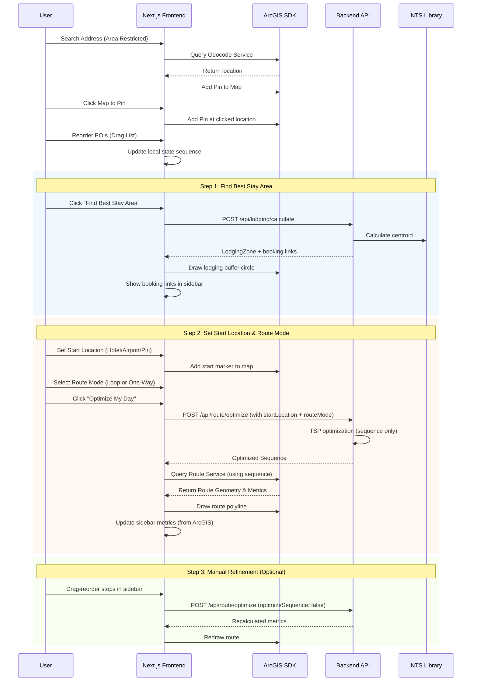

# Technical Design Document: GeoRoute Optimizer

| Metadata | Details |
| :--- | :--- |
| **Version** | 1.2 |
| **Status** | In Progress |
| **Last Updated** | 2026-01-15 |
| **Author** | Hangxi Xiang |
| **Phase** | Phase 1 (MVP) |

---

## 1. Executive Summary

This document outlines the technical architecture for Phase 1 of GeoRoute Optimizer—a spatial decision-support tool that optimizes travel itineraries. The architecture prioritizes **developer experience (DX)** during local development while enabling **serverless scale** in production via Azure Functions.

---

## 2. Technology Stack

| Layer | Technology |
|-------|------------|
| **Frontend** | Next.js 15 + ArcGIS Maps SDK for JavaScript + Tailwind CSS |
| **Backend** | .NET 9.0/10.0 / ASP.NET Core Web API |
| **Geospatial** | NetTopologySuite (NTS) |
| **PDF Export** | QuestPDF |
| **Deployment** | Azure Functions (Consumption Plan) |
| **State Management** | **Zustand** (Client store) + **URL Search Params** (Persistence/Sharing) |

---

## 3. System Architecture

### 3.1 High-Level Architecture


### 3.2 Shared Library Architecture

The key architectural decision is a **shared .NET Core library** (`GeoRoute.Core`) containing all business logic, consumed by both:

1. **ASP.NET Core Web API** — for local development with hot reload, debugging, and OpenAPI docs
2. **Azure Functions** — for production deployment with serverless scale

```
/backend
├── GeoRoute.Core/              # 📦 Shared library (all business logic)
│   ├── Services/
│   │   ├── RouteOptimizerService.cs
│   │   ├── CentroidCalculatorService.cs
│   │   └── ExportService.cs
│   ├── Models/
│   │   ├── PointOfInterest.cs
│   │   ├── OptimizedRoute.cs
│   │   └── LodgingZone.cs
│   └── GeoRoute.Core.csproj
│
├── GeoRoute.Api/               # 🖥️ Local dev API (thin wrapper)
│   ├── Controllers/
│   │   └── RouteController.cs
│   ├── Program.cs
│   └── GeoRoute.Api.csproj
│
└── GeoRoute.Functions/         # ☁️ Azure Functions (thin wrapper)
    ├── Functions/
    │   ├── OptimizeRouteFunction.cs
    │   ├── CalculateCentroidFunction.cs
    │   └── ExportPdfFunction.cs
    ├── Program.cs
    └── GeoRoute.Functions.csproj
```

---

## 4. Phase 1 API Design

### 4.1 Endpoints

| Endpoint | Method | Description | PRD Requirement |
|----------|--------|-------------|-----------------|
| `/api/lodging/calculate` | POST | Calculate geometric center + buffer for best stay area | FR-1.3, FR-1.4 |
| `/api/route/optimize` | POST | Calculate optimal route sequence with Loop or One-Way mode | FR-1.6, FR-1.7, FR-1.9 |
| `/api/export/pdf` | POST | Generate PDF itinerary | FR-1.11 |

> [!NOTE]
> Manual reordering (FR-1.10) is handled by the `/api/route/optimize` endpoint with `optimizeSequence: false`. This avoids a redundant endpoint.

### 4.2 Request/Response Models

#### Calculate Lodging Zone Request
```json
{
  "points": [
    { "id": "p1", "name": "Banff Gondola", "lat": 51.1483, "lng": -115.5700 },
    { "id": "p2", "name": "Lake Louise", "lat": 51.4167, "lng": -116.2167 },
    { "id": "p3", "name": "Moraine Lake", "lat": 51.3217, "lng": -116.1860 }
  ],
  "bufferRadiusKm": 15
}
```

> [!NOTE]
> **Auto-calculation**: The frontend automatically calls `/api/lodging/calculate` whenever there are **2 or more active POIs**. The lodging zone updates in real-time as the user adds/removes pins.

#### Calculate Lodging Zone Response
```json
{
  "centroid": { "lat": 51.2956, "lng": -115.9909 },
  "bufferRadiusKm": 15,
  "bookingLinks": {
    "bookingCom": "https://www.booking.com/searchresults.html?ss=51.2956,-115.9909&radius=15",
    "airbnb": "https://www.airbnb.com/s/homes?lat=51.2956&lng=-115.9909"
  }
}
```

#### Optimize Route Request
```json
{
  "points": [
    { "id": "p1", "name": "Banff Gondola", "lat": 51.1483, "lng": -115.5700 },
    { "id": "p2", "name": "Lake Louise", "lat": 51.4167, "lng": -116.2167 },
    { "id": "p3", "name": "Moraine Lake", "lat": 51.3217, "lng": -116.1860 }
  ],
  "startLocation": { "name": "Fairmont Banff Springs", "lat": 51.1670, "lng": -115.5570 },
  "routeMode": "loop",
  "optimizeSequence": true,
  "manualSequence": null
}
```

> [!TIP]
> - `routeMode`: `"loop"` (Return to Start) or `"one-way"` (End at last POI)
> - When `optimizeSequence: false`, the backend uses `manualSequence` (e.g., `["p2", "p1", "p3"]`) and only recalculates travel times.

#### Optimize Route Response
```json
{
  "sequence": ["p1", "p3", "p2"],
  "routeMode": "loop"
}
```

> [!NOTE]
> - The backend optimizes the **sequence** only.
> - The frontend passes this sequence to ArcGIS Route Service to calculate real-world distances and travel times.

---

## 5. Core Algorithms

### 5.1 Route Optimization (TSP Approximation)

For Phase 1 with <10 POIs, we'll use a **Nearest Neighbor heuristic with 2-opt improvement**:

See implementation: [RouteOptimizerService.cs](../backend/GeoRoute.Core/Services/RouteOptimizerService.cs)

> [!NOTE]
> For Phase 3 (20+ POIs), we'll upgrade to **Christofides algorithm** or use ArcGIS Route Service directly.

### 5.2 Centroid Calculation (NTS)

See implementation: [CentroidCalculatorService.cs](../backend/GeoRoute.Core/Services/CentroidCalculatorService.cs)

---

## 6. Azure Functions Configuration

### 6.1 Function Definitions

See implementation: [OptimizeRouteFunction.cs](../backend/GeoRoute.Functions/Functions/OptimizeRouteFunction.cs)

### 6.2 Azure Resources

| Resource | SKU | Purpose |
|----------|-----|---------|
| **Function App** | Consumption | API hosting (pay-per-execution) |
| **Storage Account** | Standard LRS | Function state |
| **Application Insights** | Basic | Monitoring |

> [!NOTE]
> **No database required.** State is stored in URL query strings, making itineraries shareable via link.

**Estimated Monthly Cost**: $5-15 (for MVP traffic levels)

---

## 7. Local Development Experience

### 7.1 Running Locally

```bash
# Terminal 1: Backend API
cd backend/GeoRoute.Api
dotnet watch run --urls "https://localhost:7001"

# Terminal 2: Frontend
# Terminal 2: Frontend
# (Running in root)
npm run dev
```

### 7.2 API Configuration

```typescript
// .env.local
NEXT_PUBLIC_API_URL=https://localhost:7001/api

// .env.production
NEXT_PUBLIC_API_URL=https://georoute-func.azurewebsites.net/api
```

---

## 8. Frontend Integration (ArcGIS)

### 8.1 Project Structure (Next.js)

```
/src
├── app/
│   ├── page.tsx                  # Main map page
│   ├── layout.tsx                # Root layout
│   └── globals.css               # Global styles (Tailwind)
├── components/
│   ├── Map/
│   │   ├── MapView.tsx           # Main map container
│   │   └── hooks/
│   │       ├── useMapInitialization.ts
│   │       ├── useMapClickHandler.ts
│   │       ├── usePoiLayer.ts
│   │       ├── useRouteLayer.ts
│   │       └── useLodgingZoneLayer.ts
│   ├── Sidebar/
│   │   ├── Sidebar.tsx           # Main sidebar container
│   │   ├── PoiList.tsx           # Draggable list for reordering POIs
│   │   ├── AddressSearch.tsx     # Search for locations
│   │   ├── RouteModeToggle.tsx   # Loop/One-way toggle
│   │   ├── ActionButtons.tsx     # Find Stay & Optimize buttons
│   │   └── Metrics.tsx           # Distance/time display with legs
│   ├── Export/
│   │   └── ExportButton.tsx      # PDF export
│   └── UI/
│       ├── SidebarToggle.tsx
│       └── LoadingOverlay.tsx
├── services/
│   └── api.ts                    # Backend API client
├── store/
│   └── useStore.ts               # Zustand store
└── types/
    └── poi.ts                    # TypeScript interfaces
```

### 8.2 ArcGIS Setup (Next.js)

See implementation: [MapView.tsx](../src/components/Map/MapView.tsx) and [arcgis-config.ts](../src/lib/arcgis-config.ts)

### 8.3 State Management (Zustand + URL Sync)

We use **Zustand** for high-performance, transient state updates (dragging pins, toggling POIs) and synchronize critical state to the URL query string for shareability.

See implementation: [useStore.ts](../src/store/useStore.ts)

---

## 9. Data Flow Diagram



---

## 10. Phase 1 Implementation Checklist

### Backend
- [x] Create `GeoRoute.Core` shared library
- [x] Implement `RouteOptimizerService` with Nearest Neighbor + 2-opt
- [x] Add `RouteMode` enum (Loop / One-Way) support
- [x] Implement `CentroidCalculatorService` with NTS
- [x] Create `GeoRoute.Api` with Controllers
- [x] Implement `ExportService` with QuestPDF
- [x] Configure CORS for local development
- [ ] Create `GeoRoute.Functions` project (Azure deployment)

### Frontend
- [x] Install `@arcgis/core` package
- [x] Create map component with basemap
- [x] Implement Address Search component
- [x] Implement Map Click to Add Pin
- [x] Implement POI add/remove/toggle
- [x] Create draggable sidebar POI list with auto-reordering
- [x] Implement Route Mode toggle (Loop / One-Way)
- [x] Implement route visualization with ArcGIS Route Service
- [x] Implement lodging zone circle
- [x] Add metrics display panel with route legs
- [x] Create PDF export with map screenshot
- [x] Add reset view button
- [x] Implement Tailwind CSS styling

### DevOps
- [ ] Set up Azure Function App (Consumption Plan)
- [ ] Configure CI/CD for Azure deployment
- [ ] Set up Application Insights

---

## 11. Risks and Mitigations

| Risk | Impact | Mitigation |
|------|--------|------------|
| ArcGIS API rate limits | Route calculation fails | Implement client-side caching, batch requests |
| Cold start latency | Poor UX on first request | Use Native AOT, pre-warm functions |
| TSP algorithm too slow for 10+ POIs | Exceeds 2-second requirement | Fallback to greedy nearest neighbor |

---

## 12. Decisions Made

| Decision | Choice | Rationale |
|----------|--------|-----------|
| **Routing Data** | ArcGIS Routing Service | Accurate road-based times; included in free tier (20K requests/month) |
| **PDF Library** | QuestPDF | Modern, MIT license, excellent .NET 10 support |
| **State Persistence** | URL Query Strings | Shareable links, no database needed, works with browser back/forward |

---

## Appendix A: Technology References

- [ArcGIS Maps SDK for JavaScript](https://developers.arcgis.com/javascript/latest/)
- [NetTopologySuite Documentation](https://nettopologysuite.github.io/NetTopologySuite/)
- [Azure Functions .NET 10 Isolated Worker](https://learn.microsoft.com/en-us/azure/azure-functions/dotnet-isolated-process-guide)
- [QuestPDF Documentation](https://www.questpdf.com/)
